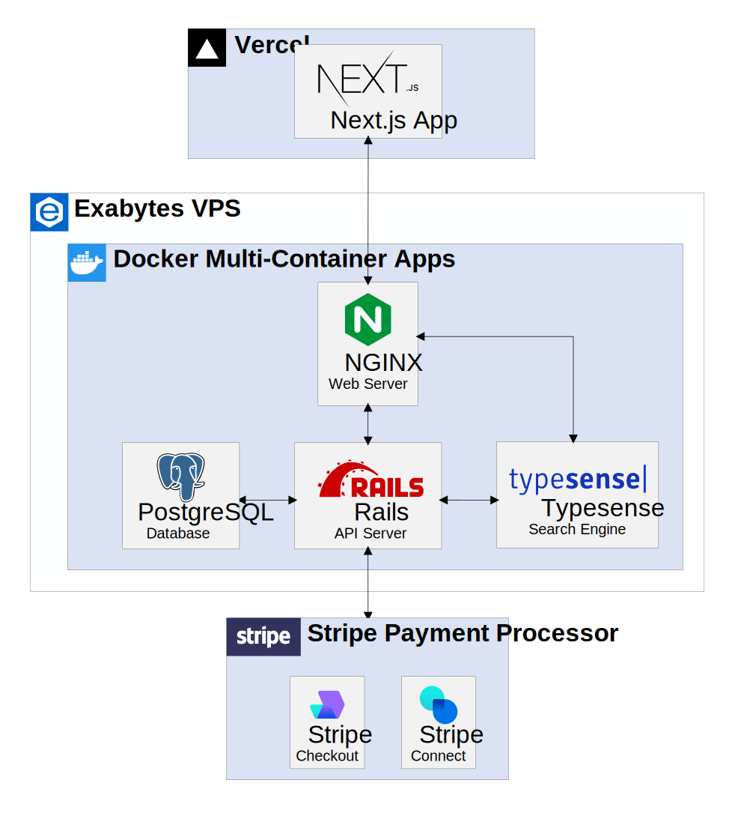

# MyHearty API

MyHearty API powers [MyHearty website](https://www.myhearty.my) and [MyHearty dashboard](https://dashboard.myhearty.my). This repository contains the backend implementation of MyHearty API in Ruby on Rails and other backend services. The Rails application is running in API mode and serves JSON resources to the frontend API clients.

## Architecture Overview

You can find the architecture overview in the illustration below, which will give you a good starting point in how the backend services interact with other services.

<div align="center">
  
</div>

## Development

To get the backend services up and running, read the following subsections.

### Requirements

If you have [Docker](https://docs.docker.com/engine/install) and [Docker Compose](https://docs.docker.com/compose/install) installed, you can set up and run the services easily via the provided [docker-compose.yml](./docker-compose.yml) file.

If you **do not** want to use Docker Compose, you need to install the following requirements to be able to run the services locally:

- Ruby 3.0+
- PostgreSQL 14.0+
- Redis 6.0+
- Typesense 0.22+
- NGINX 1.21+

The rest of the documentation is only applicable to those that have installed Docker Compose.

### Getting Started

1. Clone the repo.
   ```sh
   git clone https://github.com/myhearty-org/myhearty-api.git
   ```
2. Create a `.env` file in the root directory by copying the environment variables from the [`.env.example`](./.env.example) file. You can change versions of the services there. For more information on populating environment variables, refer to the [services section](#services).
3. To start the services using Docker Compose, you can either:
   - Run the required services only by specifying the services' names:
     ```sh
     docker-compose up -d [service1, service2, ...]
     ```
   - Run all services:
     ```sh
     docker-compose up -d
     ```
4. To start an interactive shell inside any service, run:
   ```sh
   docker-compose exec [service-name] sh
   ```
   This is useful when you want to interact with the service's internal states or run some console commands.
5. To stop the services, you can either:
   - Stop certain services only by specifying the services' names:
     ```sh
     docker-compose stop [service1, service2, ...]
     ```
   - Stop all services:
     ```sh
     docker-compose stop
     ```
6. To remove the containers together with saved states and start everything from scratch again, run:
   ```sh
   docker-compose down -v
   ```
   > **Warning** <br />
   > This is a destructive action that will delete all data stored in the PostgreSQL database and Typesense search engine.

> **Note** <br />
> If you want to enable any of the available integrations, you may want to obtain additional credentials and populate secrets for the corresponding integration. Refer to the [integrations section](#integrations) for more details.

## Services

The [docker-compose.yml](./docker-compose.yml) file contains the following services:

| Service     | Description                                                                                                               | Endpoint                |
| ----------- | ------------------------------------------------------------------------------------------------------------------------- | ----------------------- |
| `api`       | The Rails API server                                                                                                      | `http://localhost:3000` |
| `db`        | The PostgreSQL database                                                                                                   | `http://localhost:5432` |
| `typesense` | The Typesense search engine that powers instant search and geosearch in the frontend                                      | `http://localhost:8108` |
| `sidekiq`   | The background job scheduler for Ruby                                                                                     | NO ENDPOINT             |
| `redis`     | Provides data storage for Sidekiq                                                                                         | `http://localhost:6379` |
| `nginx`     | Acts as a reverse proxy server that directs the client requests to either the Rails API server or Typesense search engine | NO ENDPOINT             |

### PostgreSQL

1. You need to populate the following PostgreSQL's related environment variables before starting the database:
   ```sh
   POSTGRES_USER= # your DB username
   POSTGRES_PASSWORD= # your DB password
   POSTGRES_HOST=postgres # your DB host
   ```
   - If the variables are not set, the service will use the defaults provided by the PostgreSQL image.
   - `POSTGRES_HOST` is set to `postgres` to allow other services to communicate with the database service using network alias. See [docker-compose.yml](./docker-compose.yml#L42) for more detail.
2. To create the database, run the following commands:
   - Open a shell in the `api` container.
     ```sh
     docker-compose exec api sh
     ```
   - Create the database and load the schema:
     ```sh
     rake db:create
     rake db:schema:load
     ```
3. To seed data, run:
   ```sh
   rake db:seed SEEDS_MULTIPLIER=2
   ```
   - The environment variable `SEEDS_MULTIPLIER` defaults to 1 and controls the amount of data generated by the seeder.
   - Note that, during seeding, Typesense schema will be deleted and later re-created. Certain resources from the database will be indexed into Typesense to enable instant search. See [`01_typesense.rb`](./db/seeds/01_typesense.rb) for more detail.
   - The populated data include user credentials and fake image URLs. See [02_resources.rb](./db/seeds/02_resources.rb) to understand what types of data are being populated.
4. To remove data, run:
   ```sh
   rake db:truncate
   ```
   - This command is useful when you want to re-seed the database.
   - This is a custom task defined in [`db.rake`](./lib/tasks/db.rake).

### Typesense

[Typesense](https://typesense.org) is an open-source, typo-tolerant search engine that is optimized for instant search. It is an easier-to-use alternative for commercial search API like Algolia, which has high pricing, or open-source search engine like Elasticsearch, which can be complicated to tune.

### Sidekiq

### NGINX

## Integrations

### Credentials

### Stripe

### S3

### Geoapify

### Sendgrid

### Frontend

You can find the source code, demo and documentation for the frontend in the [myhearty](https://github.com/myhearty-org/myhearty) repository.

## Documentation

The full documentation for the MyHearty project can be found in the [myhearty-documentation](https://github.com/myhearty-org/myhearty-documentation) repository. The documentation repository contains technical documents and architecture information related to the implementation of this project.

## Contributing

If you want to contribute, please fork the repo and create a pull request by following the steps below:

1. Fork the repo.
2. Create your feature branch (`git checkout -b your-feature-branch`).
3. Commit your changes and push to the branch (`git push origin your-feature-branch`).
4. Open a pull request.

Your changes will be reviewed and merged if appropriate.

## References

- [Rails Guides: Using Rails for API-only Applications](https://guides.rubyonrails.org/api_app.html)
- [Docker Docs: Quickstart: Compose and Rails](https://docs.docker.com/samples/rails)
- [GitHub: Dockerize Rails 7 with ActionCable, Webpacker, Stimulus, Elasticsearch, Sidekiq](https://github.com/ledermann/docker-rails)
- [Devise GitHub Wiki: API Mode Compatibility Guide](https://github.com/heartcombo/devise/wiki/API-Mode-Compatibility-Guide)
- [GitHub: Accept payments with Stripe Checkout (Ruby Server Implementation)](https://github.com/stripe-samples/checkout-one-time-payments/tree/master/server/ruby)
- [Shrine GitHub Wiki: Adding Direct S3 Uploads](https://github.com/shrinerb/shrine/wiki/Adding-Direct-S3-Uploads)
