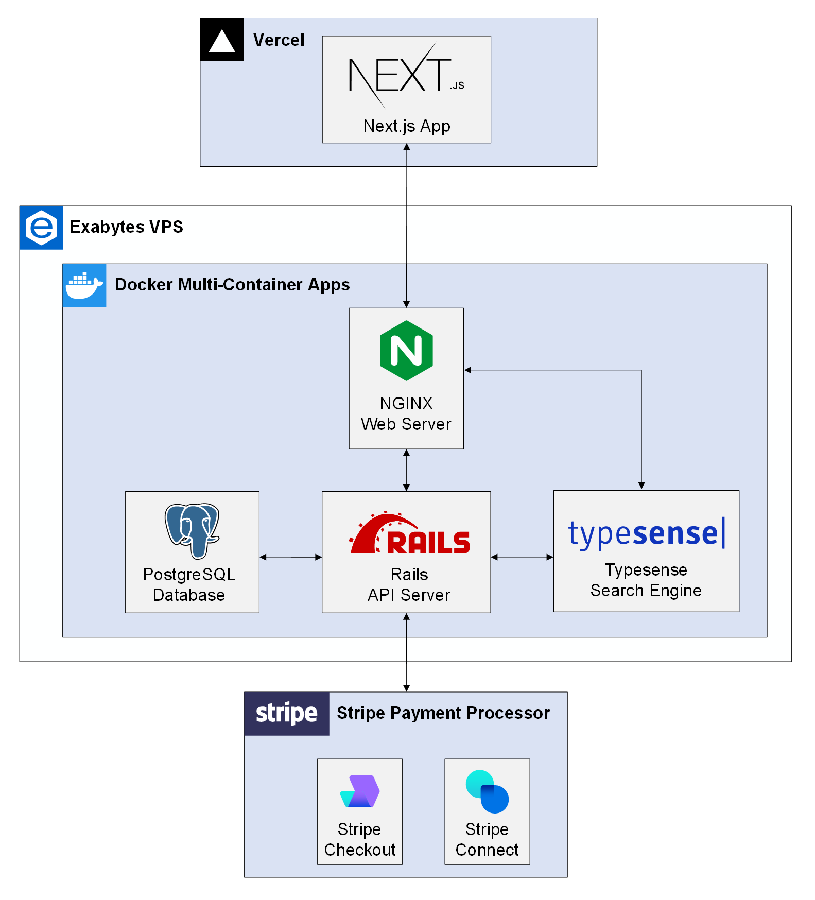

# MyHearty API

MyHearty API powers [MyHearty website](https://www.myhearty.my) and [MyHearty dashboard](https://dashboard.myhearty.my). This repository contains the backend implementation of MyHearty API in Ruby on Rails.

## Architecture Overview

You can find the architecture overview in the illustration below, which will give you a good starting point in how the backend services interact with other services.

  

## Development

To get a local API server up and running, read the following subsections.

### Requirements

You need the following requirements to be able to run MyHearty API server locally.

> **Note**  
> If you want to enable any of the available integrations, you may want to obtain additional credentials and populate environment variables for the corresponding integration. Refer to the [integrations section](#integrations) for more details.

### Getting Started

## Integrations

### Typesense

[Typesense](https://typesense.org) is an open-source, typo-tolerant search engine that is optimized for instant search. It is an easier-to-use alternative for commercial search API like Algolia, which has high pricing, or open-source search engine like Elasticsearch, which can be complicated to tune.

### Geoapify

### Frontend

You can find the source code, demo and documentation for the frontend in the [myhearty](https://github.com/myhearty-org/myhearty) repository.

## Documentation

The full documentation for the MyHearty project can be found in the [myhearty-documentation](https://github.com/myhearty-org/myhearty-documentation) repository. The documentation repository contains technical documents and architecture information related to the implementation of this project.

## Contributing

If you want to contribute, please fork the repo and create a pull request by following the steps below:

1. Fork the repo.
2. Create your feature branch (`git checkout -b your-feature-branch`).
3. Commit your changes and push to the branch (`git push origin your-feature-branch`).
5. Open a pull request.

Your changes will be reviewed and merged if appropriate.

## References

- [Docker Docs: Quickstart: Compose and Rails](https://docs.docker.com/samples/rails)
- [GitHub: Dockerize Rails 7 with ActionCable, Webpacker, Stimulus, Elasticsearch, Sidekiq](https://github.com/ledermann/docker-rails)
- [Devise GitHub Wiki: API Mode Compatibility Guide](https://github.com/heartcombo/devise/wiki/API-Mode-Compatibility-Guide)
- [GitHub: Accept payments with Stripe Checkout (Ruby Server Implementation)](https://github.com/stripe-samples/checkout-one-time-payments/tree/master/server/ruby)
- [Shrine GitHub Wiki: Adding Direct S3 Uploads](https://github.com/shrinerb/shrine/wiki/Adding-Direct-S3-Uploads)
